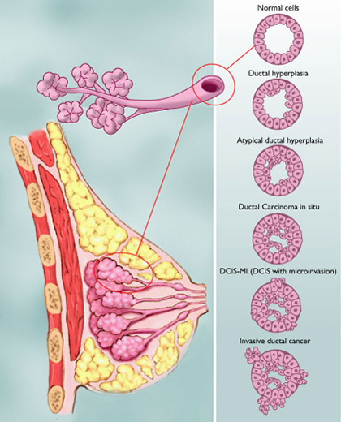

# Syöpätermejä

## Gradus - asteikko
https://www.suomalaineneturauhassyopa.fi/diagnostiikka/luokittelu/histologinen-luokitus/

WHO:n luokitus sisältää siis sytologisten ominaisuuksien arviointia:

• Gradus 1: hyvin erilaistunut (hyvä ennuste)
• Gradus 2: kohtalaisesti erilaistunut
• Gradus 3: huonosti erilaistunut (huono ennuste)

## Gleason-luokitus
Gleasonin luokituksessa otetaan huomioon eturauhassyövän tyyppipiirteet eli heterogeenisyys ja multifokaalisuus. Eturauhassyövässä, toisin kuin esimerkiksi munuaissyövässä, on tyypillistä, että syöpä saattaa kasvaa useassa erillisessä paikassa (multifokaalisuus) ja kyseiset syöpäalueet saattavat olla histologisesti (ja geneettisesti) hyvinkin erilaisia (heterogeenisyys). Kasvutapa luokitellaan asteikolla 1 – 5 (Gleason grade), grade 1: hyvin erilaistunut, grade 5: huonosti erilaistunut.

## Zubrod

0 – Asymptomatic (Fully active, able to carry on all predisease activities without restriction)
1 – Symptomatic but completely ambulatory (Restricted in physically strenuous activity but ambulatory and able to carry out work of a light or sedentary nature. For example, light housework, office work)
2 – Symptomatic, <50% in bed during the day (Ambulatory and capable of all self care but unable to carry out any work activities. Up and about more than 50% of waking hours)
3 – Symptomatic, >50% in bed, but not bedbound (Capable of only limited self-care, confined to bed or chair 50% or more of waking hours)
4 – Bedbound (Completely disabled. Cannot carry on any self-care. Totally confined to bed or chair)
5 – Death

## DCIS
Invasive ductal carcinoma (IDC), sometimes called infiltrating ductal carcinoma, is the most common type of breast cancer. About 80% of all breast cancers are invasive ductal carcinomas. Invasive means that the cancer has “invaded” or spread to the surrounding breast tissues.

## Labroista
### Ca15-3
Cancer antigen 15-3 (CA15-3) is a protein made by a variety of cells, particularly breast cancer cells. The protein moves into the blood, where it can be measured.
