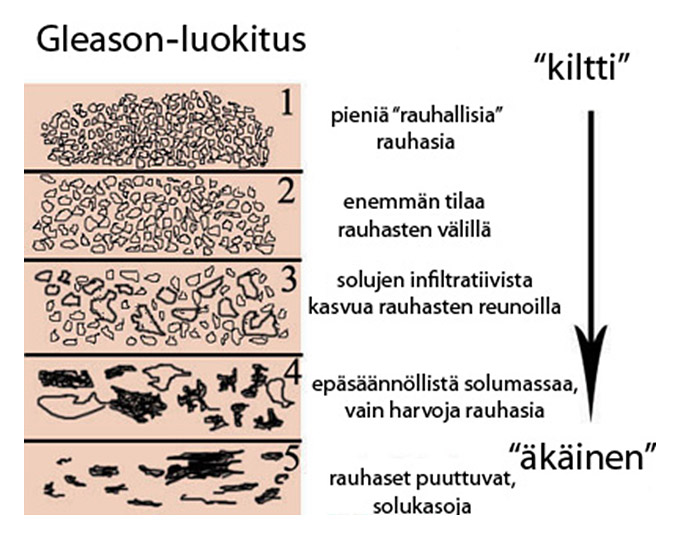

# Syöpätermejä

## Gradus - asteikko
https://www.suomalaineneturauhassyopa.fi/diagnostiikka/luokittelu/histologinen-luokitus/

Sama kuin erilaistumisaste
Gradus. Syövän pahanlaatuisuusaste, joka määritetään mikroskooppitutkimuksessa. Kasvaimen erilaistumisastetta käytetään hyväksi, kun päätetään potilaan hoidosta ja arvioidaan hänen ennustettaan.
WHO:n luokitus sisältää siis sytologisten ominaisuuksien arviointia:

• Gradus 1: hyvin erilaistunut (hyvä ennuste)
• Gradus 2: kohtalaisesti erilaistunut
• Gradus 3: huonosti erilaistunut (huono ennuste)

## Gleason-luokitus
Gleasonin luokituksessa otetaan huomioon eturauhassyövän tyyppipiirteet eli heterogeenisyys ja multifokaalisuus. Eturauhassyövässä, toisin kuin esimerkiksi munuaissyövässä, on tyypillistä, että syöpä saattaa kasvaa useassa erillisessä paikassa (multifokaalisuus) ja kyseiset syöpäalueet saattavat olla histologisesti (ja geneettisesti) hyvinkin erilaisia (heterogeenisyys). Kasvutapa luokitellaan asteikolla 1 – 5 (Gleason grade), grade 1: hyvin erilaistunut, grade 5: huonosti erilaistunut.

## Zubrod

0 – Asymptomatic (Fully active, able to carry on all predisease activities without restriction)
1 – Symptomatic but completely ambulatory (Restricted in physically strenuous activity but ambulatory and able to carry out work of a light or sedentary nature. For example, light housework, office work)
2 – Symptomatic, <50% in bed during the day (Ambulatory and capable of all self care but unable to carry out any work activities. Up and about more than 50% of waking hours)
3 – Symptomatic, >50% in bed, but not bedbound (Capable of only limited self-care, confined to bed or chair 50% or more of waking hours)
4 – Bedbound (Completely disabled. Cannot carry on any self-care. Totally confined to bed or chair)
5 – Death

## DCIS
Invasive ductal carcinoma (IDC), sometimes called infiltrating ductal carcinoma, is the most common type of breast cancer. About 80% of all breast cancers are invasive ductal carcinomas. Invasive means that the cancer has “invaded” or spread to the surrounding breast tissues.

## HER-2 positive

HER2-positive breast cancer is a breast cancer that tests positive for a protein called human epidermal growth factor receptor 2 (HER2). This protein promotes the growth of cancer cells.

In about 1 of every 5 breast cancers, the cancer cells have extra copies of the gene that makes the HER2 protein. HER2-positive breast cancers tend to be more aggressive than other types of breast cancer.

Treatments that specifically target HER2 are very effective. These treatments are so effective that the prognosis for HER2-positive breast cancer is actually quite good.

Certain standard chemotherapy drugs also can be effective in treating HER2-positive breast cancers, although these drugs don't specifically target the HER2 protein.

## HR-positive
HR is short for hormone receptor. Breast tumors are tested for both estrogen receptors (ER) and progesterone receptors (PR). Each status appears separately on your pathology report.

Approximately 80 percent of breast cancers test positive for ER. About 65 percent of those are also positive for PR.

You can test positive for ER, PR, or both. Either way, it means that hormones fuel your breast cancer. It also means that your treatment can include medications that affect hormones.

It’s also possible to test negative for both hormone receptors. If that’s the case, hormones do not fuel your breast cancer, so hormone therapy wouldn’t be effective.

## Labroista
### Ca15-3
Cancer antigen 15-3 (CA15-3) is a protein made by a variety of cells, particularly breast cancer cells. The protein moves into the blood, where it can be measured.

The reference range of serum CA 15-3 is less than 30 U/mL. (Seemingly U stands for unit) The upper limit of the range varies depending on the laboratory and kit used for the test.

