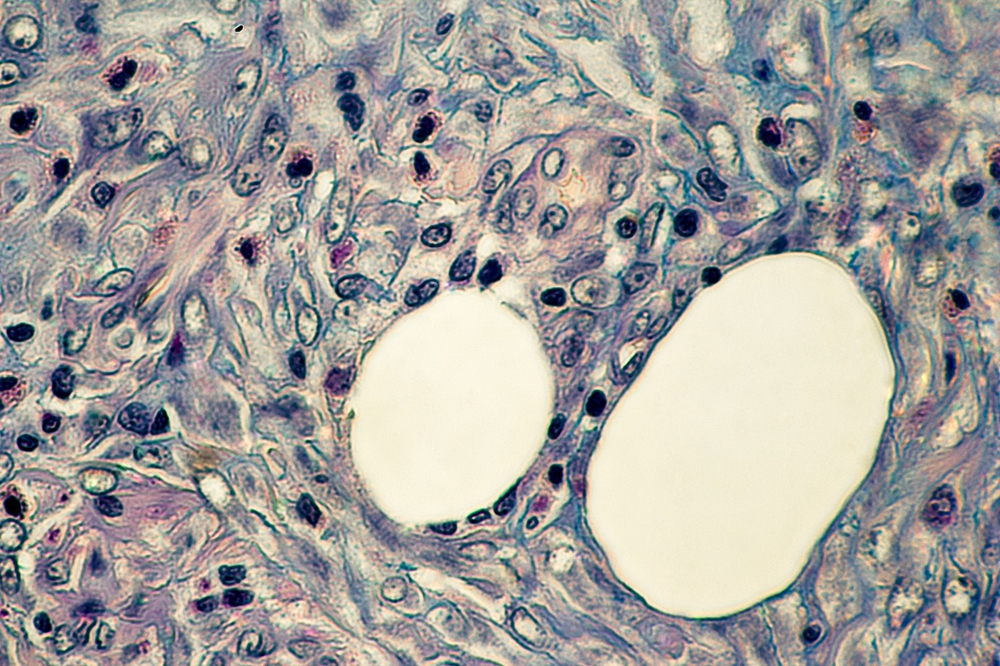

## Histologia
Histologia eli kudosoppi on tieteenala, joka tutkii kudoksia. Histologian tutkimusongelmat siis sijoittuvat organologian ja solubiologian välimaastoon, joten tutkimusvälineeksi soveltuu parhaiten elektronimikroskoopin sijasta valomikroskooppi.

